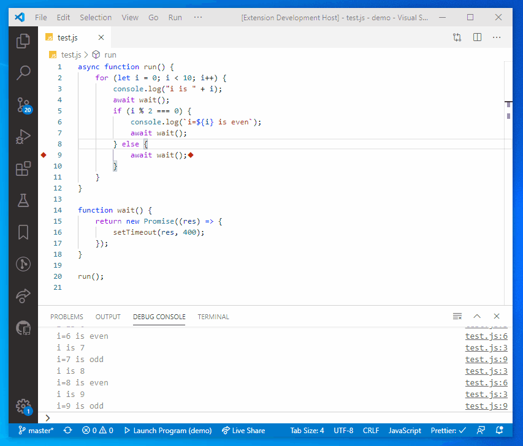
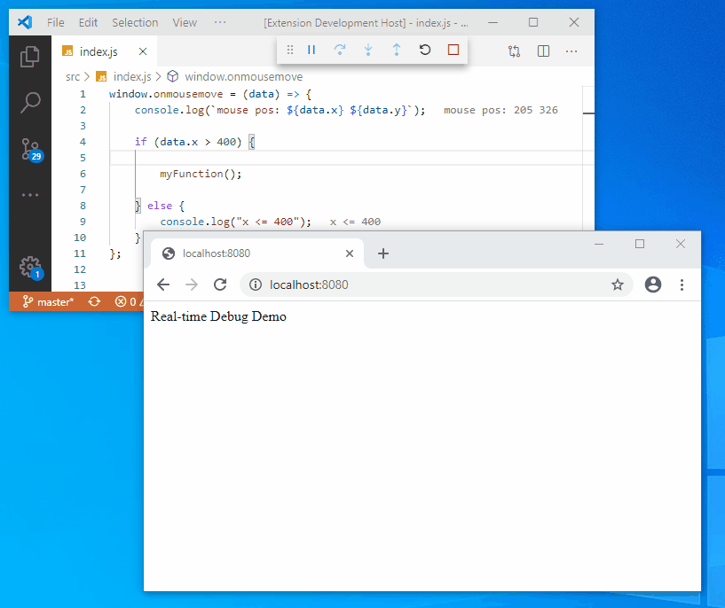

# Real-Time Debugging

## Features

-   Highlights statements that write to stdout when they are executed.
-   Statements that have a Logpoint on them write to stdout when they are executed ;)
-   Shows the text that was written to stdout next to the statement.
-   Theoretically supports every debugger and language out there (there is nothing in the implementation specific to JavaScript).

## Demo NodeJS

## Demo Web

## Logpoints

If you are familiar with logpoints, you will never ever need `console.log` for debugging again!
I highly recommend binding the command `Debug: Add Logpoint...` to a shortcut that is easy to reach (I put it on Shift+F2).

With logpoints you don't need to restart a program when you want to visualize its execution.

